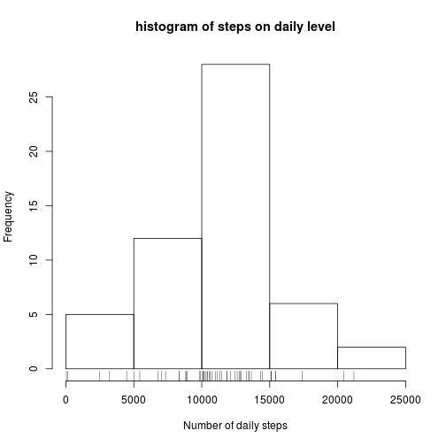
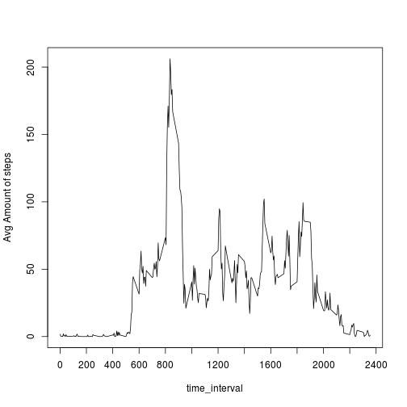
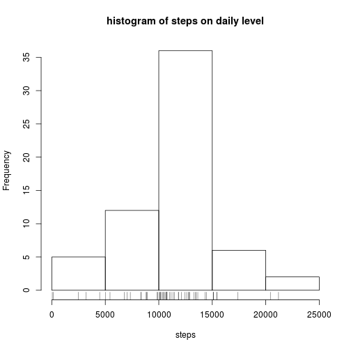
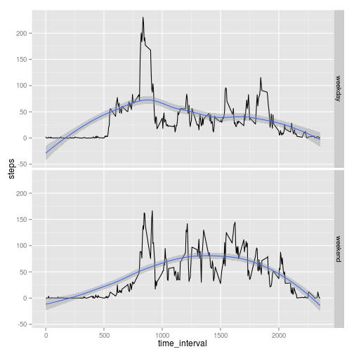

It is now possible to collect a large amount of data about personal
movement using activity monitoring devices such as a
[Fitbit](http://www.fitbit.com), [Nike
Fuelband](http://www.nike.com/us/en_us/c/nikeplus-fuelband), or
[Jawbone Up](https://jawbone.com/up). These type of devices are part of
the "quantified self" movement -- a group of enthusiasts who take
measurements about themselves regularly to improve their health, to
find patterns in their behavior, or because they are tech geeks. But
these data remain under-utilized both because the raw data are hard to
obtain and there is a lack of statistical methods and software for
processing and interpreting the data.

This assignment makes use of data from a personal activity monitoring
device. This device collects data at 5 minute intervals through out the
day. The data consists of two months of data from an anonymous
individual collected during the months of October and November, 2012
and include the number of steps taken in 5 minute intervals each day.


## Data

The data for this assignment can be downloaded from the course web
site:

* Dataset: [Activity monitoring data](https://d396qusza40orc.cloudfront.net/repdata%2Fdata%2Factivity.zip) [52K]

The variables included in this dataset are:

* **steps**: Number of steps taking in a 5-minute interval (missing
    values are coded as `NA`)

* **date**: The date on which the measurement was taken in YYYY-MM-DD
    format

* **interval**: Identifier for the 5-minute interval in which
    measurement was taken


The dataset is stored in a comma-separated-value (CSV) file and there
are a total of 17,568 observations in this
dataset.


## Initial Data Extraction

On order to extract data and build the initial dataset we use the following code 


```r
file_path <- "/home/patrick/Documents/GIT/datasciencecoursera/RepData_PeerAssessment1/activity.zip"
file_list <- unzip(file_path,list=TRUE)
row_ds <- read.csv(unz(file_path, as.character(file_list$Name)))
```

## What is mean total number of steps taken per day?

In this part of the analysis we are on purpose ignoring missing value from the initial dataset previously extracted, therefore we will build a new dataset called **ds** that omits the na values as follow


```r
ds <- na.omit(row_ds)
```

in order to calculates the number of steps per day we will build a new dataset called **step_daily** that aggregates the number of steps on daily basis as follow 


```r
step_daily <-aggregate(ds$steps,list(day=ds$date),sum) 
colnames(step_daily) <- c("day","Steps")
```


And in order to visulaize the distribution of number of steps per day we will create an histogram of it acccordingly as follow:


```r
hist(step_daily$Steps, main="histogram of steps on daily level",xlab="Number of daily steps", breaks=5)
rug(step_daily$Steps)
```

 

In order to caluclate the mean and median of the total number of steps taken per day we will use the following code


```r
avg <- mean(step_daily$Steps)
med <- median(step_daily$Steps)
```

After calculation we get the follwoing results:
**mean**        = **1.0766189 &times; 10<sup>4</sup>**
**median**      = **10765**


## What is the average daily activity pattern?

In this part of the analysis we will now focuse on the trend of taken steps over the the time of days

For that matter we will build a new dataset called **steps_int** that will avarage the number of steps over all days of the dataset

NB: At that point of the analysis we are still ignoring empty values, therefore we will keep on using ds dataset as it omits null values

Here's the code used to build **steps_int**


```r
steps_int <- aggregate(ds$steps,list(time_interval=ds$interval),mean)
colnames(steps_int) <- c("time_interval","steps")
```

Here's the code to viuslize the trend as time serie


```r
int <- steps_int$time_interval
avgsteps <- steps_int$steps
plot(int,avgsteps,
     xlab="time_interval",
     ylab="Avg Amount of steps",
     type="l",
     xaxp  = c(0, 2400, 12))
```

 

In order to know the time of day where in average we get the maximum number of steps we use the following code


```r
max_steps <- steps_int[which.max( steps_int[,2] ),]
max_time <- max_steps[,1]
max_nb_steps <- max_steps[,2]
```

=> The time when the maximum amount of steps is taken is **835** and in average the number of steps is **206.1698113**.


## Imputing missing values
In this part of analysis we want know if the missing values may introduce bias into some calculations or summaries of the data.

First of all let's calculate the amount of missing values


```r
NA_summary <- colSums(is.na(row_ds))
NA_Amt <- sum(is.na(row_ds$steps))
NA_summary
```

```
##    steps     date interval 
##     2304        0        0
```

So we can see that we have **2304** missing values in steps column and no missing values for inteval and days


In order to populate missing values we will take the average of the 5 minute for which tha data is miussing. for that matter we will re-use the **steps_int** dataset.

here's the code used to repopulate the missing values according the rule previously describe

NB: The dataset that will be generated will be called **ids**


```r
ds_NA <- row_ds[is.na(row_ds),]
merge <- merge(ds_NA,steps_int,by.x="interval",by.y="time_interval")
merge <- merge[,c(4,3,1)]
colnames(merge) <- colnames(ds)

ids <- rbind(ds,merge)
```

Now let's check if repopulating the missing values by the rule we have choosen change anything

let's first aggregate the new dataset on daily level (new dataset called **istep_daily**)


```r
istep_daily <-aggregate(ids$steps,list(day=ids$date),sum)
colnames(istep_daily) <- c("day","steps")
```

view build the histogram of it in order to see the distribution

```r
hist(istep_daily$steps, main="histogram of steps on daily level", breaks=5,xlab="steps")
rug(istep_daily$steps)
```

 


and finally let's calculate the mean and median for that new dataset

```r
iavg <- mean(istep_daily$steps)
imed <- median(istep_daily$steps)
```

After repopulating the missing values, we get the folloing results
**mean** = **1.0766189 &times; 10<sup>4</sup>**
**median = **1.0766189 &times; 10<sup>4</sup>**

when the missing values were omitted we got the following results
**mean**        = **1.0766189 &times; 10<sup>4</sup>**
**median**      = **10765**

=> Conclusion: **repopulating the missing values has no impact on the mean and the median**


## Are there differences in activity patterns between weekdays and weekends?

At that point we will try to see if there is a difference in that activity patterns between week days and weekend

For that matter we will create a new variable called **we** in the **ids** dataset as follow:

```r
Sys.setlocale("LC_ALL","C")
```

```
## [1] "LC_CTYPE=C;LC_NUMERIC=C;LC_TIME=C;LC_COLLATE=C;LC_MONETARY=C;LC_MESSAGES=en_US.UTF-8;LC_PAPER=fi_FI.UTF-8;LC_NAME=C;LC_ADDRESS=C;LC_TELEPHONE=C;LC_MEASUREMENT=fi_FI.UTF-8;LC_IDENTIFICATION=C"
```

```r
ids$we <- as.Date(ids$date,format="%Y-%m-%d")
ids$we <- weekdays(ids$we)
ids$we <- ifelse(ids$we %in% c("Saturday","Sunday"),"weekend","weekday")
```

we will then aggregate (mean) the **ids** dataset on daily and we level


```r
step_int_we <- aggregate(
      ids$steps,
      list(time_interval=ids$interval,
           time_of_week=ids$we)
      ,mean)
colnames(step_int_we) <- c("time_interval","time_of_week","steps")
```

and create a factor on the we newly created variable


```r
step_int_we$time_of_week <- factor(step_int_we$time_of_week)
```


and finally we will viusualize weekdays and weekends activity trend as follow:

```r
library(ggplot2)
qplot(time_interval,steps,data=step_int_we,
      geom=c("line","smooth"),
      facets=time_of_week~.)
```

 

Conclusion: **We can clearly see that during the weekends the number of steps taken in the afternoon is significantly higher (25%)**
